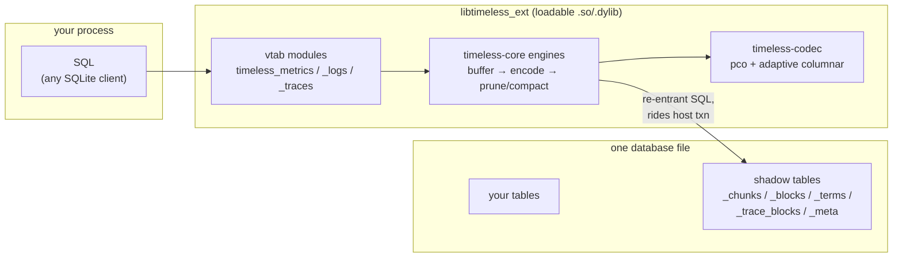

# timeless-libsql

**Compressed metrics, logs, and traces inside any SQLite or libSQL database —
one loadable extension, three virtual tables.** Think *"FTS5 for telemetry."*

[](LICENSE)


```sql
.load ./libtimeless_ext

CREATE VIRTUAL TABLE metrics USING timeless_metrics;
CREATE VIRTUAL TABLE logs    USING timeless_logs(index_keys='service,path,status');
CREATE VIRTUAL TABLE traces  USING timeless_traces;

INSERT INTO metrics(name, ts, value, labels)
  VALUES ('cpu_usage', 1753000000, 42.5, '{"host":"pvm1"}');
INSERT INTO metrics(metrics) VALUES ('flush');   -- FTS5-style command idiom

SELECT * FROM logs   WHERE service='payments' AND level='error' AND ts > :t0;
SELECT * FROM traces WHERE trace_id = x'4bf92f3577b34da6a3ce929d0e0e4736';

-- A raw Prometheus scrape body is just another blob:
INSERT INTO metrics(metrics) VALUES (readfile('scrape.prom'));
```

Chunks and blocks are compressed ([pco](https://github.com/pcodec/pcodec) +
adaptive columnar encoding) and stored in shadow tables **inside the same
database file** — so transactions, backup, and libSQL replication come from
the host, while compression, pruning, and predicate pushdown come from the
engines. Works in the `sqlite3` CLI, the rusqlite/libsql crates, and
self-hosted `sqld` (SQL over HTTP, zero client changes).

## Why

Telemetry in SQLite usually means a plain table that grows ~50–160 bytes per
row forever, or shipping data out to a second system (Prometheus, Loki,
ClickHouse) with its own storage, backup, and replication story. This
extension keeps telemetry *in the database you already have*:

- **One file.** Metrics, logs, traces, and your application data — same
  `.db`, same `BEGIN/COMMIT`, same backup, same libSQL replication stream.
- **6–200x smaller.** Lossless compression, verified bit-exact per point
  after flush and cold recovery (see [Numbers](#numbers)).
- **It's just SQL.** No query DSL: indexed dimensions are real (hidden)
  columns, so `WHERE service='api' AND level='error'` pushes down into an
  inverted term index and reads like a normal query plan.
- **Append-only with honest retention.** DELETE/UPDATE are rejected;
  retention is an explicit `'prune:<ts>'` command.

## Quick start

```sh
cargo build --release -p timeless-ext
# artifact: target/release/libtimeless_ext.so   (.dylib on macOS)
```

```sh
sqlite3 demo.db \
  ".load target/release/libtimeless_ext" \
  "CREATE VIRTUAL TABLE m USING timeless_metrics;
   INSERT INTO m(name, ts, value) VALUES ('cpu', 1, 42.5);
   INSERT INTO m(m) VALUES ('flush');
   SELECT * FROM m;"
# → cpu|1|42.5|{}
```

> **macOS:** Apple's system `/usr/bin/sqlite3` disables extension loading
> (`.load` fails with "not authorized"). `brew install sqlite` and use
> `$(brew --prefix sqlite)/bin/sqlite3` — or use the bundled-SQLite bench
> binaries in `tools/bench`, which work everywhere. Rust 1.95+ required.

## The three virtual tables

| module | row shape | ts unit | indexed dimensions (pushdown) |
|---|---|---|---|
| `timeless_metrics` | `(name, ts, value, labels)` | **seconds** | `name` =, `ts` ranges |
| `timeless_logs` | `(ts, level, message, metadata, …index keys)` | **milliseconds** | `level` =, `ts` ranges, every `index_keys` column = |
| `timeless_traces` | `(trace_id, span_id, parent_span_id, name, service, kind, status, start_ts, duration_ns, attributes)` | **nanoseconds** | `trace_id` =, `service`/`name`/`kind`/`status` =, `start_ts` ranges |

All three share the same lifecycle: inserts land in an in-memory buffer
(queryable immediately, auto-flushed at a size threshold), `'flush'` encodes
the buffer into compressed blocks riding the host transaction, and reads
transparently merge flushed blocks with the live buffer. Commands use the
FTS5 hidden-column idiom — an INSERT into the column named after the table:

```sql
INSERT INTO metrics(metrics) VALUES ('flush');       -- make buffered points durable
INSERT INTO metrics(metrics) VALUES ('compact');     -- merge small chunks
INSERT INTO logs(logs)       VALUES ('optimize');    -- re-encode into larger, purer blocks
INSERT INTO traces(traces)   VALUES ('prune:<ns>');  -- drop everything older than <ts>
```

(`prune:` takes the table's own ts unit: seconds / ms / ns.)

### Metrics

```sql
CREATE VIRTUAL TABLE metrics USING timeless_metrics;
INSERT INTO metrics(name, ts, value, labels) VALUES
  ('cpu_usage', 1753000000, 42.5, '{"host":"pvm1"}'),
  ('cpu_usage', 1753000015, 43.1, '{"host":"pvm1"}');
INSERT INTO metrics(metrics) VALUES ('flush');

SELECT name, ts, value, labels FROM metrics
 WHERE name='cpu_usage' AND ts >= 1753000015;
-- cpu_usage|1753000015|43.1|{"host":"pvm1"}
```

Aggregation is plain SQL — `avg(value)`, `min`, `max`, `GROUP BY` all work;
the vtab prunes chunks by name and ts range before SQLite ever sees a row.

Three ingest paths, one durability contract (same buffers, same flush):

1. **Tier 1 — SQL rows** (above): ~2.3M pts/s. The compatibility floor;
   works from any SQLite client.
2. **Tier 2 — batch blob**: a packed columnar blob (version byte `0x01`,
   then series table + ts/value arrays, spec in [PLAN.md](PLAN.md)) inserted
   into the hidden column: **23.8M pts/s**. For agents that batch off the
   hot path.
3. **Prometheus exposition text**: any non-batch blob is parsed as a raw
   scrape body — malformed/NaN lines are counted, not fatal, exactly like a
   real Prometheus server scrape:

```sh
curl -s target:9100/metrics -o /tmp/scrape.prom && sqlite3 metrics.db \
  ".load ./libtimeless_ext" \
  "INSERT INTO metrics(metrics) VALUES (readfile('/tmp/scrape.prom'));
   INSERT INTO metrics(metrics) VALUES ('flush');"
```

The scraping loop stays external by design (cron, curl, your app); the
vtab is passive.

### Logs

`index_keys` declares which metadata keys get inverted-index treatment —
each one becomes a real hidden column you can SELECT and filter on:

```sql
CREATE VIRTUAL TABLE logs USING timeless_logs(index_keys='service,path,status');
INSERT INTO logs(ts, level, message, metadata) VALUES
  (1753000000123, 'error', 'payment declined: card_expired',
   '{"service":"payments","path":"/api/charge","status":"402"}');
INSERT INTO logs(logs) VALUES ('flush');

SELECT ts, level, message FROM logs
 WHERE service='payments' AND level='error' AND ts > 1753000000000;
-- 1753000000123|error|payment declined: card_expired
```

- `level` is a strict vocabulary: `debug | info | warning | error`.
- Index-key equality intersects posting lists in the `_terms` shadow table;
  only matching blocks are decompressed.
- `message LIKE '%…%'` works but scans (decompresses every block) — that's
  the honest trade, see [Numbers](#numbers).
- Index keys can also be used as INSERT shorthand: a non-NULL value in the
  hidden column merges into the metadata JSON.

### Traces

OTel-shaped spans; the hero query is trace reassembly by id, routed through
a dedicated packed-trace-id index so only blocks containing that trace are
decompressed:

```sql
CREATE VIRTUAL TABLE traces USING timeless_traces;
INSERT INTO traces(trace_id, span_id, name, service, kind, status, start_ts, duration_ns)
  VALUES ('4bf92f3577b34da6a3ce929d0e0e4736', '00f067aa0ba902b7',
          'GET /api/charge', 'payments', 'server', 'error',
          1753000000123000000, 8500000);
INSERT INTO traces(traces) VALUES ('flush');

SELECT hex(trace_id), name, service, status, duration_ns FROM traces
 WHERE trace_id = x'4bf92f3577b34da6a3ce929d0e0e4736';
-- 4BF92F3577B34DA6A3CE929D0E0E4736|GET /api/charge|payments|error|8500000
```

- Ids accept packed BLOBs (16/8/8 bytes) *or* hex TEXT (32/16/16 chars) on
  insert — OTel tooling hands out hex, storage wants packed. Always returned
  as BLOBs; use `hex()` for display.
- `kind` (`internal|server|client|producer|consumer`) and `status`
  (`unset|ok|error`) are strict TEXT vocabularies mapped to storage bytes.

## How it works



`CREATE VIRTUAL TABLE metrics USING timeless_metrics` creates ordinary
shadow tables next to it (`metrics_chunks`, `metrics_meta`, …) — the FTS5
pattern. Engine writes are re-entrant SQL on the host connection, so **vtab
writes ride the host transaction**: `ROLLBACK` rolls back buffered inserts
*and* intra-transaction flushes; compaction's atomic swap needed zero
crash-recovery code because SQLite's journal already provides it.

Column encoding is adaptive per block ("codec 5"): timestamps get
delta + pco, low-cardinality strings get RLE or dictionary encoding, JSON
metadata/attributes are *shredded* into per-key typed columns, and
everything else falls back to zstd — whichever is smallest wins, decided by
the data, per column, per block.

**Durability contract:** flushed = durable, buffered = lost with the
process, never corrupt. Proven by `kill -9` crash rounds
(`tests/crash.sh`): reopen, `PRAGMA integrity_check`, every flushed
watermark present, no index row dangling.

**Multi-connection:** all connections in one process share one engine per
(db file, table) via a process-global registry — one connection's inserts
are queryable from another immediately, writers serialized by a bounded
per-table gate. This is what makes `sqld`'s connection pool work:

```sh
sqld --extensions-path ./ext-dir   # sha256 trusted.lst; loads into every connection
# curl one request: CREATE VIRTUAL TABLE → INSERT → 'flush'
# curl another (fresh pooled connection): rows come back, name pushdown, 0.19ms
```

## Numbers

Measured 2026-07-22 on an Apple M5 Pro (macOS, Rust 1.97), second run
quoted per [TESTING.md](TESTING.md); Linux reference run in
[RESULTS.md](RESULTS.md). All datasets are deterministic and deliberately
hostile (ms-jitter timestamps, per-point noise, random ids) — friendly data
compresses far better. Every number is lossless: bit-exact f64 round-trips
verified after flush + cold recovery.

### Ingest (1M points / entries / spans, single transaction)

| path | rate | vs plain table |
|---|---|---|
| metrics, Tier 1 SQL rows | 2.3M pts/s | plain: 4.2M |
| **metrics, Tier 2 batch blob** | **23.8M pts/s** | **5.6x faster than plain** |
| logs vtab | 1.1M entries/s | plain: 3.6M |
| traces vtab | 0.8M spans/s | plain + trace_id index: 1.0M |

Flush of 1M buffered points: ~110ms, paid at flush cadence, not per point.

### Storage (bytes per row, on-disk after close)

| dataset | plain | vtab | ratio |
|---|---|---|---|
| metrics, hostile (1000 series, ms-jitter, noisy values) | 52.6 | **8.3** | **6.4x** |
| metrics, friendly (regular interval, patterned values) | 46.7 | 0.23 | ~200x |
| logs, 1M entries | 120.3 | **8.9** | **13.5x** |
| traces, 960k spans (plain has a trace_id index) | 161.6 | **37.4** | **4.3x** |

### Queries (cold reopen, vtab vs plain table in the same file)

| query | plain | vtab | |
|---|---|---|---|
| logs `level='error'` count (50k rows) | 34.5ms | **15.3ms** | 2.3x |
| logs `service+level+ts` range | 119.7ms | **4.2ms** | 28x |
| traces `status='error'` count | 38.6ms | **2.8ms** | 13.8x |
| metrics name+range (10k rows of 1M) | — | **2.0ms** | pushdown |
| logs `message LIKE '%timeout%'` | **73.9ms** | 344ms | scan: plain wins |
| traces `trace_id` point lookup | **0.005ms** | 2.0ms | B-tree wins |

The last two rows are the honest ones: a compressed store decompresses to
scan, and nothing beats a native B-tree at point lookups. The trade is 4–14x
less disk and telemetry that lives inside your database.

Codec decode throughput on this machine: 1.0–1.2 GB/s (logs/traces,
`bench-codec`). Every query result in the benchmarks is checked against a
plain-table oracle in the same database.

## Trust but verify

The test harness is the most serious part of this repo:

- **Randomized property oracle** (`tools/bench`, bin `oracle`): ~50k random
  ops per seed — inserts, flush/optimize/compact at random points, every
  pushdown plan family, transactions with rollback, prunes — every result
  compared against mirrored plain tables, order-insensitive, floats by bit
  pattern. It found a real engine bug (chunk-index shadowing); trust it.
- **Crash suite** (`tests/crash.sh`): five rounds of `kill -9` at random
  moments mid-ingest, then integrity + watermark + no-dangle assertions.
- **Compression honesty** (`timeless-core` tests): 1M points verified
  bit-exact after recovery, sizes measured from disk, not bookkeeping.
- **CLI integration suite** (`tests/cli.sh`): ~25 sections through the real
  sqlite3 CLI — lifecycles, `EXPLAIN QUERY PLAN` pushdown proofs, reopen
  recovery, rollback (including auto-flush inside `BEGIN`), malformed-input
  rejection, Prometheus ingest, two-connections-one-process sharing.

```sh
cargo test -p timeless-codec -p timeless-core   # unit + property tests
./tests/cli.sh                                  # full integration suite
cd tools/bench
cargo run --release --bin oracle -- ../../target/release/libtimeless_ext.dylib
cargo run --release --bin bench  -- ../../target/release/libtimeless_ext.dylib
```

See [TESTING.md](TESTING.md) for the full guide and the rules for fair
benchmark numbers.

## Status & limits

**Experimental.** Built as a rapid POC (2026-07); the engine lineage is
production (extracted from
[timeless_metrics](https://github.com/awksedgreep/timeless_metrics)' Rust
core), the harness is serious, but the extension itself is days old. Known
limits, kept honestly ([full list](RESULTS.md#known-limits-documented-accepted-for-poc)):

- Whole-transaction ROLLBACK only — no SAVEPOINT-granular rollback.
- Buffered (pre-flush) points are visible across connections in the same
  process before COMMIT — a deliberate dirty-read trade, documented in
  RESULTS.md; *flushed* data is fully transactional.
- `ts` equality is re-checked by SQLite; only ranges and indexed dimensions
  are pruned.
- Retention is manual (`'prune:<ts>'`) — no background jobs by design; the
  vtab is passive.

## Repository layout

```
crates/
  timeless-core/    engines: pco chunk store (metrics), columnar block store
                    (logs), span block store (traces) — no SQLite dependency
  timeless-codec/   typed column encoders with adaptive strategy selection
  timeless-ext/     the loadable extension: three vtabs + shadow-table stores
tests/              cli.sh (integration), crash.sh (kill -9 durability)
tools/bench/        bench, bench-logs, bench-traces, bench-codec, oracle
                    (bundled SQLite — no system sqlite3 needed)
PLAN.md             design history and decision log
RESULTS.md          measured results, honest asterisks, known limits
TESTING.md          how to run everything yourself
```

## License

[MIT](LICENSE)
