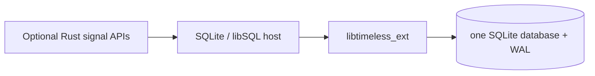

# timeless-libsql

**Compressed metrics, logs, and traces inside SQLite or libSQL.**

`timeless-libsql` is a Rust loadable extension that adds three telemetry
virtual tables to an ordinary SQLite-compatible database. It keeps compressed
blocks, indexes, rollups, and maintenance metadata in that database, so the
host retains SQLite transactions, WAL, backup, and libSQL deployment choices.

[](LICENSE)


Think of it as **FTS5 for telemetry**: load one extension, create the table
types you need, and query them with SQL.

```sql
.load ./libtimeless_ext

CREATE VIRTUAL TABLE metrics USING timeless_metrics;
CREATE VIRTUAL TABLE logs USING timeless_logs(
  index_keys='service,path,status',
  timestamp_unit='us'
);
CREATE VIRTUAL TABLE traces USING timeless_traces(
  attribute_indexes='[{"scope":"span","path":"/http.method"}]'
);
```

## The two-minute tour


Everything above happens inside a single `sqlite3` session against one `.db`
file — no server, no daemon, no sidecar. The tour seeds a synthetic fleet with
an incident baked into the middle third of the window, counts the error ramp
out of a 5-minute bucket, pivots from an error log to its trace, and prints the
storage report:

```text
  metrics     29,700,000 samples  raw    475 MB -> stored   59.7 MB  (  8.0x, 2.0 B/sample)
  logs         5,000,000 entries  raw    541 MB -> stored   42.2 MB  ( 12.8x, 8.4 B/entry)
  traces       2,880,684 spans    raw    721 MB -> stored   80.2 MB  (  9.0x, 27.8 B/span)
  total    raw 1737 MB -> stored 182 MB (9.5x); indexes 75.0 MB
```

37.6M rows ingested and queried in about two minutes on a laptop. The tour
declares its own virtual tables up front — its own `retention`, `index_keys`,
and span `attribute_indexes` — and the generator fills those. You can point it
at any table you create:

```sql
CREATE VIRTUAL TABLE web_server_metrics USING timeless_metrics;
SELECT timeless_demo('seed','small','web_server_metrics');
```

Run it yourself with [the demo quickstart](tools/demogen/QUICKSTART.md); the
generator is a second loadable extension, so the whole thing is SQL in one
`sqlite3` session.

## Current status

The project is on the pre-1.0 `0.7.x` compatibility line. Extension and Rust
signal-server versions move together and negotiate capabilities at startup;
matching version strings alone are not sufficient.

`v0.7.8` is the current release, and it is what makes the compression numbers
above honest: every signal now exports data-block payload, index, and WAL
bytes as separate series, with a raw comparator, so a ratio is raw versus
storage and never quietly folds in index or file overhead. Its tag-triggered
artifact run built, identity-checked, and install/remove-drilled all four
native Linux/macOS archives, verified the complete outer checksum set, and
published the
[`v0.7.8` GitHub Release](https://github.com/awksedgreep/timeless-libsql/releases/tag/v0.7.8)
with the archives plus `SHA256SUMS` as permanent assets. Download and
verification steps are in [the artifact guide](docs/ARTIFACTS.md).

The storage, SQL, and Rust API contracts are implemented and extensively
tested. Query-language coverage is explicit rather than implied:

| tier | shipped | experimental | deferred |
|---|---:|---:|---:|
| PromQL | 74 | 11 | 5 |
| MetricsQL | 10 | 0 | 2 |
| LogsQL | 107 | 0 | 7 |

Every row has a stable identifier, disposition, semantic test reference, and
SQL foundation where one honestly exists. See the
[query release report](docs/QUERY_RELEASE_REPORT.md) and the
[PromQL](docs/PROMQL_FEATURE_MATRIX.md) and
[LogsQL](docs/LOGSQL_FEATURE_MATRIX.md) matrices for the exact claim.

## What is in this repository

| component | purpose |
|---|---|
| `libtimeless_ext` | Loadable SQLite/libSQL extension containing all three storage engines and public SQL query surfaces. |
| `timeless-metrics-api` | Standalone Rust metrics HTTP server with Prometheus-compatible query routes and a separate MetricsQL tier. |
| `timeless-logs-api` | Standalone Rust log ingest/query server with strict LogsQL parsing and bounded evaluation. |
| `timeless-traces-api` | Standalone Rust OTLP ingest, Jaeger query, and native rich-span server. |
| `libdbhealth_ext` | Separate optional SQLite database-health extension; not bundled into `libtimeless_ext`. |

The three signal servers are independently usable. They do not contain a
second storage engine and never read private shadow tables: all durable work
crosses public `libtimeless_ext` SQL or batch interfaces.

Because the extension executes inside its SQLite/libSQL host, its virtual-table
callbacks follow an explicit [FFI panic policy](docs/FFI_PANIC_POLICY.md):
malformed input and recoverable runtime failures return SQL errors, while a
residual Rust panic is treated as an unrecoverable extension defect and may
abort the host process.

Phoenix, Elixir, dashboards, token issuance, cluster administration, and UI
state are outside this repository. They can act as a control plane, but no
storage or query request requires BEAM, a NIF, Rocket, or an Elixir fallback.


```mermaid
flowchart LR
    SQL[SQLite / libSQL host] --> EXT[libtimeless_ext]
    HTTP[Optional Rust signal APIs] --> SQL
    EXT --> DB[(one SQLite database + WAL)]
```

## Quick start

Build the extension from a clean checkout:

```sh
cargo build --release -p timeless-ext --locked
# Linux: target/release/libtimeless_ext.so
# macOS: target/release/libtimeless_ext.dylib
```

Load it and exercise all three signals:

```sh
sqlite3 telemetry.db <<'SQL'
.load target/release/libtimeless_ext

CREATE VIRTUAL TABLE metrics USING timeless_metrics;
INSERT INTO metrics(name, ts, value, labels)
VALUES ('cpu_usage', 1753000000, 42.5, '{"host":"web1"}');
INSERT INTO metrics(metrics) VALUES ('flush');
SELECT name, ts, value, labels FROM metrics WHERE name = 'cpu_usage';

CREATE VIRTUAL TABLE logs USING timeless_logs(index_keys='service');
INSERT INTO logs(ts, level, message, metadata)
VALUES (1753000000123, 'error', 'payment declined',
        '{"service":"payments","retryable":false}');
INSERT INTO logs(logs) VALUES ('flush');
SELECT ts, level, message FROM logs WHERE service = 'payments';

CREATE VIRTUAL TABLE traces USING timeless_traces;
INSERT INTO traces(
  trace_id, span_id, name, service, kind, status, start_ts, duration_ns
) VALUES (
  '4bf92f3577b34da6a3ce929d0e0e4736', '00f067aa0ba902b7',
  'GET /checkout', 'checkout', 'server', 'ok',
  1753000000123000000, 8500000
);
INSERT INTO traces(traces) VALUES ('flush');
SELECT lower(hex(trace_id)), name, duration_ns
  FROM traces
 WHERE trace_id = x'4bf92f3577b34da6a3ce929d0e0e4736';
SQL
```

Apple's `/usr/bin/sqlite3` disables extension loading. On macOS, install
SQLite with Homebrew and use `$(brew --prefix sqlite)/bin/sqlite3`, or embed
the extension in a Rust host.

For a guided walkthrough, continue with the [user guide](docs/GUIDE.md).
The [SQL API reference](docs/SQL_API_REFERENCE.md) is canonical when a schema,
command, bound, batch format, or error detail matters.

## Storage models

| module | public data | timestamp unit | authoritative buffer | primary pruning |
|---|---|---:|---:|---|
| `timeless_metrics` | metric name, float64 sample, canonical string labels | seconds | 4,096 points per series | name, series id, time, label matchers |
| `timeless_logs` | eight severities, message, canonical typed/nested metadata | milliseconds or microseconds | 8,192 entries | time, severity, declared metadata keys, optional trigram message index |
| `timeless_traces` | complete rich-span v2 IDs, relationships, timing, typed attributes/events/links, resource and scope data | nanoseconds | 8,192 spans | time, trace id, service/name/kind/status, duration bounds, optional typed attribute equality |

Writes are append-only. `UPDATE` and row-oriented `DELETE` are rejected;
retention is an explicit, block-aware maintenance operation.

All current and legacy public batch generations remain readable within data
ABI 1. New formats use new version bytes or frame magics. Private shadow-table
names and codecs are implementation details and are never a migration API.

### Metrics

Metrics retain IEEE-754 float bits through binary ingest, compression, flush,
and reopen. The extension supports SQL rows, named and resolved binary batches,
and Prometheus exposition text:

```sql
INSERT INTO metrics(metrics) VALUES (readfile('scrape.prom'));
INSERT INTO metrics(metrics) VALUES ('flush');
```

Optional rollup ladders retain coarse aggregates after raw data ages out:

```sql
CREATE VIRTUAL TABLE metrics USING timeless_metrics(
  retention='14d',
  rollups='5m@90d,1h@0'
);

INSERT INTO metrics(metrics) VALUES ('rollup');

SELECT labels, ts, value
  FROM timeless_rollup(
    'metrics', 'cpu_usage', NULL, 300, :start_s, :stop_s, 'avg'
  );
```

The stored sample model is float64. Classic Prometheus histogram series work
as ordinary floats; native histograms require a future versioned typed storage
design. A Prometheus stale marker is not yet an end-to-end server-ingress
contract, so the stable server does not claim stale-marker semantics.

### Logs

Logs preserve all eight severities:

`debug`, `info`, `notice`, `warning`, `error`, `critical`, `alert`, and
`emergency`.

Metadata preserves JSON strings, numbers, booleans, nulls, arrays, nested
objects, and the distinction between missing, null, and empty values. Declared
`index_keys` project string values for posting-list pruning without replacing
the authoritative typed object.

Use `message_index='trigram'` when measured substring workloads justify the
additional write and storage cost. The hidden `message_contains` input offers
exact case-insensitive substring filtering, and `max_work_entries` places an
inclusive pre-decode cap on a scan.

### Traces

Rich-span v2 preserves packed trace/span/parent IDs, kind and status, status
description, trace state and flags, typed span attributes, events, links,
resource and instrumentation-scope data, schema URLs, and every dropped-value
counter. OTLP fields are not silently blanked to fit an older representation.

Inclusive duration predicates use per-block minimum/maximum metadata to reject
impossible blocks before decode. Older blocks remain exact through a
conservative fallback; bounded public `optimize` backfills the small metadata
rows without rewriting compressed span payloads.

Up to eight explicitly configured span, resource, or scope JSON Pointer paths
can use typed scalar equality pruning:

```sql
CREATE VIRTUAL TABLE traces USING timeless_traces(
  attribute_indexes='[{"scope":"span","path":"/http.method"}]'
);

SELECT lower(hex(trace_id)), lower(hex(span_id)), start_ts
  FROM traces
 WHERE start_ts BETWEEN :start_ns AND :stop_ns
   AND attribute_filter =
       '{"scope":"span","path":"/http.method","value":"GET"}';
```

The block filter is a negative filter only; surviving rows are rechecked
exactly. Unconfigured paths remain available through ordinary SQLite JSON1.
TraceQL, complete-trace finalization, and structural trace quantifiers are not
claimed by this release line.

## Flush, maintenance, and durability

Buffered rows are immediately queryable but are not durable against process
loss until the extension flushes them. Automatic flush thresholds limit the
tail; an explicit flush is the durability barrier:

```sql
INSERT INTO metrics(metrics) VALUES ('flush');
INSERT INTO logs(logs) VALUES ('flush');
INSERT INTO traces(traces) VALUES ('flush');
```

Commands use the FTS5-style hidden column named after the created table:

```sql
INSERT INTO metrics(metrics) VALUES ('compact');
INSERT INTO metrics(metrics) VALUES ('rollup');
INSERT INTO logs(logs) VALUES ('optimize:65536');
INSERT INTO traces(traces) VALUES ('optimize:65536');
INSERT INTO traces(traces) VALUES ('prune:1753000000000000000');
```

Flush and maintenance participate in the host SQLite transaction. Rollback
restores both live engine state and shadow-table writes. A crash may lose the
unflushed tail, but must not corrupt flushed state. The crash suite proves
reopen integrity, durable watermarks, and index consistency after `SIGKILL`.

The Rust signal servers stop admission, drain accepted work, issue a final
ordered flush, checkpoint WAL, join workers, and release their owner lease on
SIGINT or SIGTERM. `SIGKILL` cannot run cleanup and therefore retains the same
flushed-versus-buffered contract.

All durable Timeless state is in the containing database and WAL. Back up or
replicate the complete database through the host's supported SQLite/libSQL
mechanism. Copying selected virtual rows or private shadow tables is not a
compatible backup.

## Public SQL query surfaces

The extension exposes reusable storage-aware SQL primitives, not PromQL or
LogsQL syntax:

| signal | public query surfaces |
|---|---|
| metrics | `timeless_raw`, `timeless_raw_batches`, `timeless_raw_frame`, `timeless_latest`, `timeless_latest_frame`, `timeless_aggregate`, `timeless_aggregate_frame`, `timeless_grid`, `timeless_window`, `timeless_window_batches`, `timeless_rollup`, `timeless_rollup_batches`, `timeless_series`, `timeless_label_values` |
| logs | bounded base-table scans, `timeless_log_count`, `timeless_log_buckets`, `timeless_log_values`, `timeless_log_query_stats` |
| traces | indexed base-table scans, `timeless_trace_services`, `timeless_trace_operations`, `timeless_trace_buckets` |
| all | `timeless_stats` and `timeless_capabilities()` |

Ordinary SQL remains preferred whenever it is correct and efficient. The
[SQL equivalents](docs/QUERY_SQL_EQUIVALENTS.md) provide 135 parameterized
recipes using only public extension surfaces; the Rust documentation harness
executes 173 statements so examples fail when they drift.

Packed frames are optional transport optimizations for high-cardinality or
remote hosts. Row-oriented SQL remains supported. Every packed layout,
timestamp boundary, matcher rule, and work guard is specified in the
[SQL API reference](docs/SQL_API_REFERENCE.md) and
[query cookbook](docs/QUERIES.md).

## Standalone Rust signal APIs

Build all three servers:

```sh
cargo build --release --workspace --manifest-path servers/Cargo.toml --locked
```

Each binary accepts the matching extension, database, and optional listener:

```text
timeless-<signal>-api <libtimeless_ext.so> <database> [listen-address]
```

| binary | default listener | main protocols |
|---|---:|---|
| `timeless-metrics-api` | `127.0.0.1:19439` | Prometheus text import/scraping, PromQL, explicit MetricsQL routes, VictoriaMetrics JSON-line import/export, native discovery |
| `timeless-logs-api` | `127.0.0.1:19429` | NDJSON rich-log ingest, LogsQL query and field discovery, NDJSON live tail |
| `timeless-traces-api` | `127.0.0.1:19449` | OTLP JSON/protobuf/gzip ingest, Jaeger discovery/search, native rich-span reads, NDJSON live span tail |

Each binary also serves its own operational stats as Prometheus text
exposition on `GET /metrics`, including a `timeless_build_info` metric so
version drift between environments is visible on any compatible dashboard.

Release binaries start open — no authentication and no configuration —
matching the library `Config::default()` and comparable telemetry servers.
Set `TIMELESS_AUTH_MODE=required` with `TIMELESS_AUTH_POLICY_FILE` to enable
token verification; the bundled `timeless-authctl` handles Ed25519 keygen,
policy scaffolding, and token minting. `TIMELESS_ADMIN_KEY` optionally locks
the administrative routes alone while ingest and query stay open.
Non-loopback binding is
rejected unless `TIMELESS_ALLOW_NON_LOOPBACK=1` is explicitly set for a
separately secured deployment. TCP is the implemented transport; this release
does not claim a Unix-socket listener.

Startup acquires an exclusive signal owner lease, validates build/capability
compatibility and the additive database schema ledger, and fails before
binding when the extension, schema, retention, or required work guards are
incompatible. See the [server API reference](docs/SERVER_API_REFERENCE.md)
for every route, environment variable, scope, limit, response, and lifecycle
rule.

## Query-language boundary

PromQL, MetricsQL, and LogsQL parsing and expression evaluation live in the
Rust signal APIs. SQLite never receives those languages as extension syntax.
The extension owns general pruning, packed results, reductions, storage
statistics, and bounded row access that are also useful to direct SQL users.

The stable PromQL tier covers the shipped float-series rows in the matrix.
The MetricsQL routes are a separately named compatibility tier and never
change the default PromQL routes. LogsQL preserves rich Timeless values while
pinning intentional VictoriaLogs differences per row. Invalid or unsupported
syntax fails explicitly before storage rather than being ignored or delegated.

Deferred and experimental work is kept outside the landing page in the
[deferred-work index](docs/DEFERRED_WORK.md). It lists every stable matrix ID,
the reason it did not ship, the design or oracle prerequisite that would
unblock it, and the evidence files to resume from.

## Rust embedding and libSQL

Rust applications that do not need HTTP can register the same production
extension surfaces in-process:

```text
timeless-ext = { path = "crates/timeless-ext", default-features = false,
                 features = ["embedded"] }
```

Call `timeless_ext::register_telemetry(&connection)` for every connection.
The `embedded` and loadable-entrypoint modes are mutually exclusive. The
[embedded Rust guide](docs/EMBEDDED_RUST.md) includes a complete example and
the direct libSQL gate.

Self-hosted `sqld` can load the extension for every connection and expose SQL
over Hrana. Pin a tested sqld/libSQL build and follow the ownership and
capability rules in the [sqld guide](docs/SQLD.md). Timeless does not own the
host's replication topology, retry policy, or network-byte accounting.

## Performance and evidence

Timeless is optimized for embedded footprint, bounded memory, and useful
telemetry pruning. It does not claim a competitive benchmark against
VictoriaMetrics, VictoriaLogs, or Jaeger today.

The retained deterministic SQLite controls show the storage tradeoff clearly:

| dataset | plain SQLite bytes/row | Timeless bytes/row | reduction |
|---|---:|---:|---:|
| hostile metrics | 52.6 | 8.3 | 6.3x |
| regular/patterned metrics | 46.7 | 0.23 | about 200x |
| logs | 120.3 | 8.9 | 13.5x |
| traces | 161.6 | 37.4 | 4.3x |

Compression can lose to a native B-tree for exact point lookups and to an
uncompressed scan when no useful predicate can prune blocks. The benchmarks
retain those losses. Optional indexes and query primitives are accepted only
when exact controls show that they avoid meaningful reads, decode, allocation,
copies, or row crossings.

The [query evidence protocol](docs/QUERY_EVIDENCE.md),
[storage findings](docs/QUERY_STORAGE_FINDINGS.md), and
[testing runbook](TESTING.md) record latency tails, result cardinality,
logical and physical storage, WAL/checkpoint behavior, decoded work, response
bytes, cancellation, and RSS HWM. Historical general-purpose results remain
in [RESULTS.md](RESULTS.md) and are labeled as historical.

## Documentation

| document | use it for |
|---|---|
| [User guide](docs/GUIDE.md) | SQL-first walkthrough and operational concepts. |
| [Observability schema](docs/OBSERVABILITY_SCHEMA.md) | Friendly views, naming, lifecycle, and compatibility policy. |
| [SQLite extension API](docs/SQL_API_REFERENCE.md) | Canonical tables, columns, TVFs, commands, batches, frames, capabilities, transactions, and errors. |
| [Rust signal server API](docs/SERVER_API_REFERENCE.md) | Binaries, routes, authentication, limits, lifecycle, backup, and configuration. |
| [Query cookbook](docs/QUERIES.md) | Copyable SQL query patterns. |
| [PromQL matrix](docs/PROMQL_FEATURE_MATRIX.md) | Exact PromQL and MetricsQL coverage and dispositions. |
| [LogsQL matrix](docs/LOGSQL_FEATURE_MATRIX.md) | Exact LogsQL coverage and dispositions. |
| [SQL equivalents](docs/QUERY_SQL_EQUIVALENTS.md) | Executable SQL foundations for language features. |
| [Deferred work](docs/DEFERRED_WORK.md) | Stable IDs, prerequisites, evidence locations, and the workflow for resuming future query work. |
| [Query release report](docs/QUERY_RELEASE_REPORT.md) | Shipped, experimental, and deferred counts, evidence, findings, and higher-order recommendations. |
| [Trace query matrix](docs/2026-08-08_trace_query_matrix.md) | Current trace vectors, rejected shortcuts, and future complete-trace prerequisites. |
| [TraceQL prerequisite matrix](docs/2026-08-08_traceql_prerequisite_matrix.md) | Storage prerequisites already shipped and the exact remaining TraceQL work. |
| [Compatibility](docs/COMPATIBILITY.md) | Version, capability, data ABI, format, and platform rules. |
| [Upgrade and rollback](docs/UPGRADE.md) | Safe ownership, backup, preflight, replacement, and rollback procedure. |
| [Artifacts](docs/ARTIFACTS.md) | Target matrix, archive inventory, checksums, installation, and current publication state. |
| [Embedded Rust](docs/EMBEDDED_RUST.md) | In-process use without HTTP. |
| [Self-hosted sqld](docs/SQLD.md) | libSQL/sqld deployment boundary. |
| [Testing](TESTING.md) | Complete local correctness, oracle, fault, soak, packaging, and benchmark commands. |
| [Changelog](CHANGELOG.md) | Versioned public changes. |

## Testing

The canonical order is in [TESTING.md](TESTING.md). The short core is:

```sh
cargo fmt --all -- --check
cargo test --workspace --locked
cargo test --manifest-path tools/query-harness/Cargo.toml --locked
cargo run --quiet --manifest-path tools/query-harness/Cargo.toml \
  --locked -- contracts
```

The complete gate also builds the real release extension and servers, runs
all ignored extension-backed contracts, executes 135 SQL recipes, runs the
45-section CLI/oracle/crash suite, validates dbhealth, exercises embedded Rust
and direct libSQL, and can run short or two-hour production fault gates.

Scratch files are removed by default. The testing guide identifies the few
remaining Python benchmark utilities and their Rust migration status; the
production extension, API, query, SQL-equivalence, fixture, crash, and
persistent-host test logic is Rust.

GitHub Actions has no scheduled, branch-push, or pull-request test trigger.
The query and production workflows are manually dispatched; native release
packaging runs only for `v*` tags.

## Repository layout

```text
crates/timeless-codec/   adaptive column codecs
crates/timeless-core/    metrics, logs, and trace block engines
crates/timeless-ext/     SQLite extension and embedded registration
crates/dbhealth-ext/     separate database-health extension
servers/                 standalone Rust signal APIs
tools/query-harness/     query contracts, evidence, and production gates
tools/release-tool/      native package builder and verifier
tools/bench/             deterministic storage/query benchmarks
tests/                   SQLite CLI, correctness, crash, and dbhealth gates
docs/                    public references, matrices, plans, and evidence
```

## License

[MIT](LICENSE)
