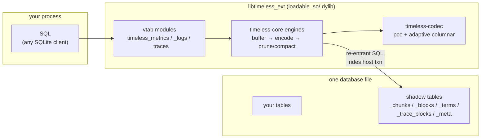

# timeless-libsql

**Compressed metrics, logs, and traces inside any SQLite or libSQL database —
one loadable extension, three virtual tables.** Think *"FTS5 for telemetry."*

[](LICENSE)


```sql
.load ./libtimeless_ext

CREATE VIRTUAL TABLE metrics USING timeless_metrics;
CREATE VIRTUAL TABLE logs    USING timeless_logs(index_keys='service,path,status');
CREATE VIRTUAL TABLE traces  USING timeless_traces;

INSERT INTO metrics(name, ts, value, labels)
  VALUES ('cpu_usage', 1753000000, 42.5, '{"host":"pvm1"}');
INSERT INTO metrics(metrics) VALUES ('flush');   -- FTS5-style command idiom

SELECT * FROM logs   WHERE service='payments' AND level='error' AND ts > :t0;
SELECT * FROM traces WHERE trace_id = x'4bf92f3577b34da6a3ce929d0e0e4736';

-- A raw Prometheus scrape body is just another blob:
INSERT INTO metrics(metrics) VALUES (readfile('scrape.prom'));
```

Chunks and blocks are compressed ([pco](https://github.com/pcodec/pcodec) +
adaptive columnar encoding) and stored in shadow tables **inside the same
database file** — so transactions, backup, and libSQL replication come from
the host, while compression, pruning, and predicate pushdown come from the
engines. Works in the `sqlite3` CLI, the rusqlite/libsql crates, and
self-hosted `sqld` (SQL over HTTP, zero client changes).

## Why

Telemetry in SQLite usually means a plain table that grows ~50–160 bytes per
row forever, or shipping data out to a second system (Prometheus, Loki,
ClickHouse) with its own storage, backup, and replication story. This
extension keeps telemetry *in the database you already have*:

- **One file.** Metrics, logs, traces, and your application data — same
  `.db`, same `BEGIN/COMMIT`, same backup, same libSQL replication stream.
- **6–200x smaller.** Lossless compression, verified bit-exact per point
  after flush and cold recovery (see [Numbers](#numbers)).
- **It's just SQL.** No query DSL: indexed dimensions are real (hidden)
  columns, so `WHERE service='api' AND level='error'` pushes down into an
  inverted term index and reads like a normal query plan.
- **Append-only with honest retention.** DELETE/UPDATE are rejected;
  retention is an explicit `'prune:<ts>'` command.

**Born for the edge.** Compression happens at the point of collection —
points buffer in memory and land in the WAL only as compressed blocks —
so libSQL replication (to a hub, to S3-compatible storage via bottomless,
to an embedded replica) ships the *compressed* bytes, never the raw
points. On a metered uplink that is the whole story. One device recording
100 metrics at 1 Hz for a month:

| storage | wire format | monthly upstream |
|---|---|---:|
| plain SQLite table | raw rows (~52.6 B/pt) | **~13.6 GB** |
| timeless, hostile data | pco blocks (8.3 B/pt) | **~2.2 GB** |
| timeless, friendly data | pco blocks (0.23 B/pt) | **~60 MB** |

For IoT on cellular backhaul the flush cadence doubles as radio
discipline — one batched, compressed write per interval instead of a
row-trickle keeping the modem awake — and with [dbhealth](docs/DBHEALTH.md)
on the same device, every unit self-monitors and its health history rides
the same replication stream home. Sensors at the edge, pennies on the
uplink, one file to sync.

## Quick start

```sh
cargo build --release -p timeless-ext
# artifact: target/release/libtimeless_ext.so   (.dylib on macOS)
```

```sh
sqlite3 demo.db \
  ".load target/release/libtimeless_ext" \
  "CREATE VIRTUAL TABLE m USING timeless_metrics;
   INSERT INTO m(name, ts, value) VALUES ('cpu', 1, 42.5);
   INSERT INTO m(m) VALUES ('flush');
   SELECT * FROM m;"
# → cpu|1|42.5|{}
```

> **macOS:** Apple's system `/usr/bin/sqlite3` disables extension loading
> (`.load` fails with "not authorized"). `brew install sqlite` and use
> `$(brew --prefix sqlite)/bin/sqlite3` — or use the bundled-SQLite bench
> binaries in `tools/bench`, which work everywhere. Rust 1.95+ required.

## The three virtual tables

| module | row shape | ts unit | indexed dimensions (pushdown) |
|---|---|---|---|
| `timeless_metrics` | `(name, ts, value, labels)` | **seconds** | `name` =, `ts` ranges |
| `timeless_logs` | `(ts, level, message, metadata, …index keys)` | **milliseconds** | `level` =, `ts` ranges, every `index_keys` column =, exact `message_contains` =; optional hidden `max_work_entries` bounds examined entries |
| `timeless_traces` | core IDs/timing plus typed `attributes`, `status_description`, `events`, `resource`, `instrumentation_scope` | **nanoseconds** | `trace_id` =, `service`/`name`/`kind`/`status` =, `start_ts` ranges |

All three share the same lifecycle: inserts land in an in-memory buffer
(queryable immediately, auto-flushed at a size threshold), `'flush'` encodes
the buffer into compressed blocks riding the host transaction, and reads
transparently merge flushed blocks with the live buffer. Commands use the
FTS5 hidden-column idiom — an INSERT into the column named after the table:

```sql
INSERT INTO metrics(metrics) VALUES ('flush');       -- make buffered points durable
INSERT INTO metrics(metrics) VALUES ('compact');     -- merge small chunks
INSERT INTO logs(logs)       VALUES ('optimize');    -- re-encode into larger, purer blocks
INSERT INTO logs(logs)       VALUES ('optimize:65536'); -- cap source entries this turn
INSERT INTO traces(traces)   VALUES ('optimize:65536'); -- same bounded maintenance for spans
INSERT INTO traces(traces)   VALUES ('prune:<ns>');  -- drop everything older than <ts>
```

`optimize:<entries>` is the incremental logs/traces maintenance form. Raw
compression runs before eligible size-tiered merges, and one complete merge
cohort may slightly exceed the requested budget so maintenance always makes
progress. `timeless_stats('logs'|'traces')` exposes actionable/deferred backlog
plus separate raw and merge entry, byte, and time counters. (`prune:` takes the
table's own ts unit: seconds / ms / ns.)

Retention can also be automatic — declared at CREATE, applied during the
maintenance the engine already performs (no background threads; the vtab
stays passive):

```sql
CREATE VIRTUAL TABLE metrics USING timeless_metrics(retention='30d');
CREATE VIRTUAL TABLE logs    USING timeless_logs(index_keys='service', retention='7d');
CREATE VIRTUAL TABLE traces  USING timeless_traces(retention='72h');
```

The cutoff is *data time* (newest ingested timestamp minus the window),
so it's deterministic, replay-safe, and inert for backfills; pruning is
chunk/block-granular at flush/compact/optimize boundaries.

**Rollup ladder (metrics)** — declare downsampling tiers and raw ages
out while coarse aggregates survive, which is what makes "a year of
metrics in one SQLite file" plausible:

```sql
CREATE VIRTUAL TABLE metrics USING timeless_metrics(
  retention='14d',                  -- raw tier
  rollups='5m@90d,1h@0');          -- resolution@retention, 0 = forever

INSERT INTO metrics(metrics) VALUES ('rollup');  -- also runs at 'compact'

SELECT labels, ts, value                         -- explicit tier reads
  FROM timeless_rollup('metrics', 'cpu_usage', NULL, 300, :t0, :t1, 'avg');
--                                           agg: avg|sum|min|max|count|last

SELECT series_id, labels, buckets                -- all fields, one row/series
  FROM timeless_rollup_batches(
    'metrics', 'cpu_usage', NULL, 300, :t0, :t1);
```

Buckets are `[B, B+R)` with exactly-documented aggregate math
(bit-verified against naive bucket computation); tiers fill as buckets
settle (one bucket-width margin) and are append-only. Tier reads are
explicit — no silent substitution for raw. On the 1M-point bench, the
1-minute tier answers the per-bucket average in **4.1ms** vs 34.5ms for
the GROUP BY over raw, and building the whole tier costs 80ms. The packed
`timeless_rollup_batches` form keeps the row TVF intact while avoiding six
separate scans for hosts that need the complete rollup record.

### Metrics

```sql
CREATE VIRTUAL TABLE metrics USING timeless_metrics;
INSERT INTO metrics(name, ts, value, labels) VALUES
  ('cpu_usage', 1753000000, 42.5, '{"host":"pvm1"}'),
  ('cpu_usage', 1753000015, 43.1, '{"host":"pvm1"}');
INSERT INTO metrics(metrics) VALUES ('flush');

SELECT name, ts, value, labels FROM metrics
 WHERE name='cpu_usage' AND ts >= 1753000015;
-- cpu_usage|1753000015|43.1|{"host":"pvm1"}
```

Aggregation is plain SQL — `avg(value)`, `min`, `max`, `GROUP BY` all work;
the vtab prunes chunks by name and ts range before SQLite ever sees a row.
For a scalar result per series, `timeless_aggregate` is the chunk-aware fast
path and avoids shipping raw samples through SQLite.

Three ingest paths, one durability contract (same buffers, same flush):

1. **Tier 1 — SQL rows** (above): ~2.3M pts/s. The compatibility floor;
   works from any SQLite client.
2. **Tier 2 — batch blob**: a packed columnar blob (version byte `0x01`,
   then series table + ts/value arrays, spec in [PLAN.md](PLAN.md)) inserted
   into the hidden column: **23.8M pts/s**. For agents that batch off the
   hot path.
3. **Prometheus exposition text**: any non-batch blob is parsed as a raw
   scrape body — malformed/NaN lines are counted, not fatal, exactly like a
   real Prometheus server scrape. Standard label-value `\n`, `\"`, and
   `\\` escapes are decoded before series identity is resolved:

```sh
curl -s target:9100/metrics -o /tmp/scrape.prom && sqlite3 metrics.db \
  ".load ./libtimeless_ext" \
  "INSERT INTO metrics(metrics) VALUES (readfile('/tmp/scrape.prom'));
   INSERT INTO metrics(metrics) VALUES ('flush');"
```

The scraping loop stays external by design (cron, curl, your app); the
vtab is passive.

Embedded hosts can resolve a durable series id once and omit metric/label
strings from steady-state writes:

```sql
INSERT INTO metrics(metrics, name, labels)
  VALUES ('resolve', 'cpu_usage', '{"host":"pvm1"}');
SELECT last_insert_rowid();                     -- durable series_id

INSERT INTO metrics(series_id, ts, value)
  VALUES (:series_id, 1753000015, 43.1);
```

The corresponding resolved batch begins with version byte `0x02`, followed
by `flags:u8=0`, `reserved:u16=0`, `n_points:u32 LE`, then columnar
`series_id:i64[n]`, `timestamp:i64[n]`, and `value_bits:u64[n]` arrays, all
little-endian. The entire id set is validated before any point is buffered.
Named batch `0x01` remains the portable path when the caller has no durable
id cache. Both binary formats preserve all 64 value bits through buffering,
flush, and reopen, including distinct NaN payloads. Text exposition `NaN` is
an ordinary float NaN, not an implicit Prometheus stale marker; JSON ingest
cannot represent a NaN payload. Consequently the Rust PromQL server does not
yet claim stale-marker semantics. That feature requires a bit-preserving
server ingress and marker-aware selector/window execution that excludes only
`0x7ff0000000000002`, never every NaN.

The same durable ID is a read handle. SQLite pushes an equality constraint
through the base metrics table and every per-series metrics query TVF:

```sql
SELECT ts, value FROM metrics
 WHERE series_id = :series_id AND ts BETWEEN :t0 AND :t1;

SELECT value
  FROM timeless_aggregate('metrics', 'cpu_usage', NULL, :t0, :t1, 'avg')
 WHERE series_id = :series_id;
```

The ID is intersected with the TVF's metric and matcher arguments and composes
with joins against `timeless_series`. It is durable and table-scoped, but is not
portable between independently created database files.

**Query kernels** — table-valued functions evaluate the dominant
dashboard shapes inside the engine, so remote deployments (sqld, HTTP)
ship grid points instead of every raw sample:

```sql
-- Matcher-aware raw narrow waist (one row per sample):
SELECT series_id, labels, ts, value
  FROM timeless_raw('metrics', 'cpu_usage', '{"host":"pvm1"}', :t0, :t1);

-- Same waist, one packed point blob per series for embedded hosts:
SELECT series_id, labels, points
  FROM timeless_raw_batches('metrics', 'cpu_usage', '{"host":"pvm1"}', :t0, :t1);

-- Wide fanout form: every non-empty series in one versioned columnar frame:
SELECT frame
  FROM timeless_raw_frame(
    'metrics', 'cpu_usage', '{"env":"prod"}', :t0, :t1,
    :max_work_points);

-- one scalar reduction per matched series; inclusive [:t0, :t1]
-- aggregate: avg | sum | min | max | count
SELECT series_id, labels, value
  FROM timeless_aggregate('metrics', 'cpu_usage', '{"env":"prod"}', :t0, :t1, 'avg');

-- every scalar result in one TAF1 frame:
SELECT frame
  FROM timeless_aggregate_frame(
    'metrics', 'cpu_usage', '{"env":"prod"}', :t0, :t1, 'avg');

-- newest point per matched series; inclusive bounds
SELECT series_id, labels, ts, value
  FROM timeless_latest('metrics', 'cpu_usage', '{"env":"prod"}', :t0, :t1);

-- every newest point in one TLF1 frame:
SELECT frame
  FROM timeless_latest_frame('metrics', 'cpu_usage', '{"env":"prod"}', :t0, :t1);

-- last sample per grid point, per series (instant-selector shape):
--                 table      metric       label filter    start  stop   step lookback
SELECT labels, ts, value
  FROM timeless_grid('metrics', 'cpu_usage', '{"host":"pvm1"}', :t0, :t1, 60, 90);

-- sliding-window operations per grid point:
--   folds:       sum | min | max | count | avg
--   counters:    delta | increase | rate
--   percentiles: pNN (exact nearest-rank: p50, p95, p99.9, …)
--   robust:      tavg:N (trimmed mean, drop N% from each tail)
SELECT labels, ts, value
  FROM timeless_window('metrics', 'requests_total', NULL, :t0, :t1, 60, 300, 'rate');

-- Same result, one versioned bucket blob per series for embedded/remote hosts:
SELECT series_id, labels, buckets
  FROM timeless_window_batches(
    'metrics', 'requests_total', NULL, :t0, :t1, 60, 300, 'rate',
    NULL, :max_work_points);
```

Both packed calls retain their original unbounded arity. A supplied positive
`max_work_points` is an inclusive, pre-decode guard: raw frames cap candidate
stored/buffered points; window batches independently cap candidate input and
possible grid output. Errors return no partial blob. The capability document
advertises each guarded surface under `query_surfaces`.

`timeless_window_batches` uses `TWB1 | count:u32 LE | timestamps:i64 LE[] |
validity bitmap | value_bits:u64 LE[]`. The bitmap also preserves the optional
`fill='null'` shape. See [the query cookbook](docs/QUERIES.md#packed-window-batches)
for the exact byte contract. The row-oriented `timeless_window` API remains
unchanged.

`timeless_raw_frame` uses `TRF1 | series_count:u32 LE | total_points:u64 LE |
series_ids:i64 LE[] | point_counts:u32 LE[] | timestamps:i64 LE[] |
value_bits:u64 LE[]`. Counts partition the point columns by series; empty
series are omitted and series slice order is unspecified. It complements,
rather than replaces, the row-oriented and per-series batch raw APIs. See
[the packed-raw contract](docs/QUERIES.md#packed-raw-frame).

Rollup hosts can likewise use `timeless_rollup_batches`, whose `TRB1` blob
contains bucket timestamps, exact integer counts, all six aggregate values,
and stored last-sample timestamps in one row per series. See
[the packed-rollup contract](docs/QUERIES.md#packed-rollup-batches).

`timeless_aggregate` emits no row for an empty series/range and returns
`count` as a SQLite INTEGER. Fully covered chunks use persisted statistics;
only boundary chunks are decoded. `sum`/`avg` therefore accumulate points
left-to-right within each chunk, then chunk sums in index order, so a flat SQL
scan can differ by floating-point rounding. Count is exact. NaNs count as
stored points, make `sum`/`avg` SQL `NULL`, and are ignored by `min`/`max`
unless every value is NaN, in which case those are `NULL` too.

`timeless_latest` emits at most one row per matched series and no row for an
empty range. The greatest timestamp wins; duplicate maximum timestamps keep
the first point in the raw engine's stable order. New chunks persist that
point as metadata, so the usual unbounded-latest query does not decompress
history. Databases created by older versions are upgraded additively: legacy
chunks use the decode fallback until compaction rewrites them.

For high-cardinality host-language reads, `timeless_aggregate_frame` and
`timeless_latest_frame` return the same logical row results in one versioned
columnar blob. Their `TAF1`/`TLF1` layouts, strict Rust decoders, and a
dependency-free Python decoder are documented in
[the query cookbook](docs/QUERIES.md#packed-aggregate-frame). The row TVFs
remain the normal relational interface; frames are an additive transport and
never change the on-disk format.

**Counter kernels are raw window folds, NOT PromQL**: `increase` uses
the standard reset-adjustment rule but does **no** boundary
extrapolation, lookback, or staleness inference — for conformance-grade
PromQL semantics, use the evaluator layer above the waist. Percentiles
are the opposite story: because raw samples are kept, `p95` is the
**exact** value — no `le`-bucket interpolation, no sketch error — which
Prometheus-lineage systems cannot offer. `timeless_trace_buckets` gains
`dur_p50/dur_p95/dur_p99` for the same reason: exact p95 latency per
service per bucket. Outlier handling is always parameter-explicit
(`tavg:5`) — the database never decides what an outlier is.

Both windows are half-open `(t - width, t]`; grid points with no sample
produce no row — unless you ask for a dense grid with the optional
trailing **fill** argument (`'none'` default, `'null'` = every grid
point emitted per matched series, value `NULL` where the window is
empty; a series with no points in range stays absent either way):

```sql
SELECT labels, ts, value
  FROM timeless_grid('metrics', 'cpu_usage', NULL, :t0, :t1, 60, 90, 'null');
```

The kernels are deliberately *semantics-free* — no
lookback defaults, no staleness or rate math (that belongs to the query
layer above) — which is what makes them safe: every result is verified
bit-for-bit against naive evaluation, in the test suite and in the
benchmarks. Callers that don't know about them lose nothing: the raw
scan they replace still works everywhere.

Measured on the 1M-point bench dataset (1-minute grid × 100 hosts over
the whole range): the raw-scan fallback ships 99,900 samples and
evaluates client-side in **17.9ms**; `timeless_grid` returns the same
16,600 grid rows in **1.6ms** — 11x, before a network is even involved.

**Label matchers** — every kernel TVF's filter argument accepts matcher
objects alongside plain equality strings:

```sql
SELECT labels, ts, value FROM timeless_grid('metrics', 'cpu_usage',
  '{"host": {"re": "web-.*"}, "env": {"neq": "dev"}}', :t0, :t1, 60, 90);
```

| Filter value | Meaning |
|---|---|
| `"v"` | equality (pushed into the label index, as before) |
| `{"neq": "v"}` | not equal |
| `{"re": "pat"}` | regex match ([Rust `regex`](https://docs.rs/regex) dialect — RE2 family: no backrefs/lookaround) |
| `{"nre": "pat"}` | regex non-match |

Regexes are **fully anchored** (PromQL-style): the pattern must match
the whole value — `web-.*` means *starts with* `web-`, `.*web.*` means
*contains*. A label absent from a series matches as the empty string
`""`, so `{"neq": "prod"}` includes series without the label and
`{"nre": ".+"}` means "label absent or empty". Matchers prune the
candidate *series list* before any chunks are read — cost is
per-series, not per-point. Invalid patterns are loud errors naming the
pattern and the label.

**Introspection** — three more table-valued functions answer "what's in
here?" without decompressing anything:

```sql
SELECT * FROM timeless_series('metrics');  -- one row per series: name, labels,
                                           -- min/max ts (incl. buffered), points,
                                           -- chunks, buffered  (~3ms for 1000 series)
SELECT * FROM timeless_stats('metrics');   -- key/value health rows; works for
                                           -- logs and traces tables too
SELECT value FROM timeless_label_values('metrics', 'cpu_usage', 'host');
                                           -- sorted distinct label values —
                                           -- the dropdown-population query

-- Packed metric reads expose cumulative candidate/decode/byte/return work:
SELECT key, value FROM timeless_stats('metrics')
 WHERE key LIKE 'raw_batch_query_%' ORDER BY key;

-- Logs expose block, entry, payload, index, timestamp-unit, and current
-- optimizer-source totals without exposing extension shadow tables:
SELECT key, value FROM timeless_stats('logs')
 WHERE key IN ('timestamp_unit','blocks','raw_blocks','compressed_blocks',
               'buffered_entries','disk_entries','total_entries',
               'bytes_on_disk','raw_bytes','compressed_bytes','terms',
               'index_bytes','ts_min','ts_max','optimize_source_entries',
               'optimize_source_bytes')
 ORDER BY key;

-- Request-local work is separate from cumulative/aggregate stats. Fully
-- consume this scan and immediately consume its single-use report on the
-- same connection:
SELECT ts, level, message FROM logs
 WHERE service='api' AND max_work_entries=100000 ORDER BY ts;
SELECT payload_bytes_read, candidate_blocks, processed_blocks,
       decoded_entries, processed_entries, matched_entries, returned_entries
  FROM timeless_log_query_stats('logs');

-- Optional discovery filters use the same matcher JSON and are applied
-- before unrelated catalog rows cross SQLite:
SELECT labels FROM timeless_series('metrics', 'cpu_usage',
  '{"host":{"re":"web-.*"},"env":{"neq":"dev"}}');
SELECT value FROM timeless_label_values('metrics', 'cpu_usage', 'host',
  '{"env":{"neq":"dev"}}');
```

The aggregate log rows above are intentionally not VictoriaLogs
`| block_stats` compatibility. That pipe reports VictoriaLogs-specific
per-field dictionaries, bloom filters, stream identities, and filesystem
parts, which Timeless blocks do not retain. There is therefore no honest
public SQL equivalent today; use `timeless_stats('logs')` for aggregate
operational accounting and consult the
[LogsQL matrix](docs/LOGSQL_FEATURE_MATRIX.md) for the exact deferred
prerequisite. Private shadow tables are not a supported workaround.
Likewise, the `blocks` row is the current persisted total—not LogsQL
`| blocks_count`, whose upstream value counts request-local processing batches
after preceding pipeline stages. Timeless does not currently expose that
lineage, and subtracting cumulative `query_candidate_blocks` values is unsafe
when queries overlap. The separate `timeless_log_query_stats` surface reports
actual request-local scan work, but deliberately does not claim that private
pipeline-batch lineage. Its same-connection, single-use contract and complete
LogsQL mapping are executable as
[`SQL-LOG-026`](docs/QUERY_SQL_EQUIVALENTS.md#sql-log-026-request-local-log-query-statistics).

For worked recipes — reset-corrected counter math in pure SQL, top-k
per bucket, cross-metric joins, IQR/σ outlier exclusion, gap-fill
patterns — see **[docs/QUERIES.md](docs/QUERIES.md)**; every recipe in
it is executed by the test suite, so the cookbook can't rot.
Hosts must use these public rows rather than querying implementation-owned
shadow tables; additive keys may appear as the extension gains observable
capabilities.

### Logs

`index_keys` declares which metadata keys get inverted-index treatment —
each one becomes a real hidden column you can SELECT and filter on:

```sql
CREATE VIRTUAL TABLE logs USING timeless_logs(index_keys='service,path,status');
INSERT INTO logs(ts, level, message, metadata) VALUES
  (1753000000123, 'error', 'payment declined: card_expired',
   '{"service":"payments","path":"/api/charge","status":"402"}');
INSERT INTO logs(logs) VALUES ('flush');

SELECT ts, level, message FROM logs
 WHERE service='payments' AND level='error' AND ts > 1753000000000;
-- 1753000000123|error|payment declined: card_expired
```

- `level` is a strict eight-value vocabulary: `debug | info | notice |
  warning | error | critical | alert | emergency`. Legacy flat batches retain
  their four-level representation; rich-v1 batches preserve all eight names.
- `metadata` is canonical typed JSON. Strings, numbers, booleans, nulls,
  arrays, and nested objects survive flush, optimize, and reopen. Declared
  `index_keys` project string values for posting-list pruning without replacing
  the authoritative typed object.
- Index-key equality intersects posting lists in the `_terms` shadow table;
  only matching blocks are decompressed.
- `message LIKE '%…%'` scans by default — or declare
  `message_index='trigram'` and substring search becomes a block-pruning
  problem: every 3-byte window of the pattern's literal runs must appear
  in a block for it to decode, and SQLite still rechecks rows exactly.
  1M entries: `LIKE '%timeout%'` in **48.3ms** vs 334.5ms unindexed —
  and vs 74.5ms for the plain table, flipping the one benchmark row this
  extension used to lose (index overhead ~1.5 MB, opt-in).
- For a literal case-insensitive substring rather than full SQL LIKE syntax,
  use the exact hidden input `message_contains`. It filters before rows cross
  the virtual-table boundary and can consume `ORDER BY ts ... LIMIT/OFFSET`:

  ```sql
  SELECT ts, level, message FROM logs
   WHERE message_contains='timeout' AND max_work_entries=100000
   ORDER BY ts DESC LIMIT 100;
  ```

  ASCII matching is allocation-free; non-ASCII matching uses Unicode
  lowercase equivalence. Trigram pruning remains conservative and is disabled
  for a non-ASCII needle so it cannot introduce false negatives.
- Index keys can also be used as INSERT shorthand: a non-NULL value in the
  hidden column merges into the metadata JSON.
- **Batch ingest**: the flat string-only v0 batch remains readable; rich-v1
  preserves microsecond timestamps, all eight severities, and canonical typed
  metadata. Inserting either public columnar blob into the hidden table column
  ingests a whole batch in one statement, validated all-or-nothing. The
  extension's 8,192-entry buffer remains authoritative.

**Bucket kernel** — the dominant logs-dashboard shape (volume histogram
by level or any index key) evaluated engine-side; level-pure blocks that
fit inside one bucket are counted from metadata without decoding:

```sql
SELECT bucket_ts, group_key, n FROM timeless_log_buckets(
  'logs', 'level', '{"service":"api"}', :t0, :t1, 60000);
-- buckets are [t, t+step) aligned to :t0 — histograms bin forward
```

1M entries, whole range, 1-minute buckets: **95.9ms** vs 543.5ms for the
GROUP BY over the raw vtab (5.7x, totals verified equal).

**Scalar count** — exact count without materializing a log rowset. `filter` is
a flat filter JSON object: `level` selects severity and every other string
member is a metadata equality. The remaining arguments are optional exact
substring, inclusive timestamp bounds, and a positive examined-entry cap:

```sql
SELECT n FROM timeless_log_count(
  'logs', '{"level":"error","service":"api"}', 'timeout', :t0, :t1,
  :max_work_entries
);
```

Only the table name is required. Fully covered unfiltered or level-pure blocks
use persisted `entry_count` without reading payloads. Boundary, legacy-mixed,
metadata-filtered, and message-filtered blocks decode one at a time. The
optional final cap is charged before candidate blocks are decoded and fails
without a partial result. The same guard is a hidden equality input on
`timeless_logs` and the final argument to bounded field discovery:

```sql
SELECT value FROM timeless_log_values(
  'logs', 'host', '{"level":"error"}', NULL,
  :t0, :t1, 1000, :max_work_entries
);
```

`timeless_capabilities()` advertises these guards under
`query_surfaces.timeless_logs`, `.timeless_log_count`, and
`.timeless_log_values`. Omitting them preserves the older unbounded direct-SQL
contract; the Rust logs API requires the capability and always binds a hard
limit. Request-local reports are advertised under
`query_surfaces.timeless_log_query_stats` with `request_local`,
`same_connection`, and `single_use` flags.

After fully consuming a successful `timeless_logs` scan, direct callers can
consume its actual work once on the same connection:

```sql
SELECT query_total_ns, payload_bytes_read,
       candidate_blocks, processed_blocks,
       decoded_entries, processed_entries,
       matched_entries, returned_entries,
       values_read, timestamps_read
  FROM timeless_log_query_stats('logs');
```

New, failed, and cancelled scans clear stale reports. See
[`SQL-LOG-026`](docs/QUERY_SQL_EQUIVALENTS.md#sql-log-026-request-local-log-query-statistics)
for all sixteen INTEGER columns and the exact fourteen-field string mapping
used by LogsQL `| query_stats`.

### Traces

OTel-shaped spans; the hero query is trace reassembly by id, routed through
a dedicated packed-trace-id index so only blocks containing that trace are
decompressed:

```sql
CREATE VIRTUAL TABLE traces USING timeless_traces;
INSERT INTO traces(trace_id, span_id, name, service, kind, status, start_ts, duration_ns)
  VALUES ('4bf92f3577b34da6a3ce929d0e0e4736', '00f067aa0ba902b7',
          'GET /api/charge', 'payments', 'server', 'error',
          1753000000123000000, 8500000);
INSERT INTO traces(traces) VALUES ('flush');

SELECT hex(trace_id), name, service, status, duration_ns FROM traces
 WHERE trace_id = x'4bf92f3577b34da6a3ce929d0e0e4736';
-- 4BF92F3577B34DA6A3CE929D0E0E4736|GET /api/charge|payments|error|8500000
```

- Ids accept packed BLOBs (16/8/8 bytes) *or* hex TEXT (32/16/16 chars) on
  insert — OTel tooling hands out hex, storage wants packed. Always returned
  as BLOBs; use `hex()` for display.
- `kind` (`internal|server|client|producer|consumer`) and `status`
  (`unset|ok|error`) are strict TEXT vocabularies mapped to storage bytes.
- `attributes`, `resource`, and `instrumentation_scope` are typed JSON
  objects; `events` is a typed JSON array. Booleans, numbers, nulls, arrays,
  and nested objects survive flush, optimize, and reopen.
- `service` is derived with the same precedence as timeless_traces:
  string `attributes["service.name"]`, then resource `service.name`, then the
  explicit compatibility column. The derived value is what gets indexed.
- Batch byte `0x01` is the stable core-span v0 format. Byte `0x02` is the
  additive rich-span v1 format; both remain readable. The extension's
  8,192-span auto-flush threshold is authoritative for both paths.

**Bucket kernel** — per-service span stats per time bucket (count,
errors, duration sum/min/max; percentiles stay above the waist):

```sql
SELECT bucket_ts, service, spans, errors, dur_sum, dur_min, dur_max
  FROM timeless_trace_buckets('traces', NULL, :t0, :t1, 60000000000);
```

960k spans, whole range: **246ms** vs 582ms for the GROUP BY equivalent
(2.4x — duration math requires decoding every span, so this one is
decode-bound).

## Query language roadmaps

The SQL primitives above are the storage/query foundation, not an implicit
claim of complete PromQL or LogsQL compatibility. The living feature maps say
exactly what is implemented, where each missing construct belongs, and what
must be tested before it can be marked shipped:

- [Query feature ownership and workflow](docs/QUERY_FEATURES.md)
- [PromQL feature matrix](docs/PROMQL_FEATURE_MATRIX.md)
- [LogsQL feature matrix](docs/LOGSQL_FEATURE_MATRIX.md)
- [SQL equivalents for query-language features](docs/QUERY_SQL_EQUIVALENTS.md)
- [Query/storage findings](docs/QUERY_STORAGE_FINDINGS.md)
- [Shipped-row conformance references](docs/QUERY_TEST_REFERENCES.md)
- [Pinned query semantic oracles](docs/QUERY_ORACLES.md)
- [Query benchmark and evidence protocol](docs/QUERY_EVIDENCE.md)
- [Sequential query implementation plan](docs/2026-08-04_query_surface_implementation_plan.md)

PromQL, the explicitly named MetricsQL compatibility tier, and LogsQL
parsing/evaluation live in the Rust signal APIs. MetricsQL-only syntax never
changes the default PromQL routes and never enters SQLite as query syntax. The
MetricsQL routes currently implement conditional `default`/`if`/`ifnot`,
operation-level `keep_metric_names`, bounded `union`/`alias` composition, and
bounded `label_set`/`label_del` transformations, plus implicit
`default_rollup` and the established one-argument window-less rollups with
VictoriaMetrics scrape/carry-in semantics, plus complete-grid
`range_avg/min/max/sum` with pinned slot-index, missing-value, name, collision,
and IEEE behavior, plus cumulative `running_avg/min/max/sum` with pinned carry
and computed-NaN behavior, plus request-step-relative direct/subquery windows,
resolutions, signed offsets, and adaptive `0i` rollups, plus request-owned
`start()`/`end()`/`step()` context values with explicit unsupported-function
errors, plus VictoriaMetrics plural histogram quantiles over cumulative and
`vmrange` buckets with one shared bucket read; direct SQL users retain
the same public mechanics with executable `SQL-MQL-001` through `SQL-MQL-007`,
`SQL-MQL-009` through `SQL-MQL-010`, and `SQL-MQL-012` recipes. The LogsQL API
includes the four VictoriaLogs pattern anchors and all seven typed placeholders,
exact-prefix matching, and static multi-exact `in(...)` membership over bounded
public rows while retaining Timeless's rich JSON types, plus static
`contains_all(...)` phrase conjunction and `contains_any(...)` phrase
disjunction over the same rich projection, plus exact top-level primitive
membership for retained JSON arrays through `json_array_contains_any(...)`,
plus ordered non-overlapping `seq(...)` phrase matching with the same Unicode
boundaries and strict static-list grammar, plus query-backed `in`,
`contains_any`, and `contains_all` with exact one-field output, request-local
caching, nested composition, and cumulative work/state/deadline bounds,
plus bounded `equals_common_case(...)` and `contains_common_case(...)` using
the pinned Go-simple Unicode expansion rather than general case folding,
plus lower-inclusive/upper-exclusive bytewise `string_range(...)` filtering
over the same non-mutating rich projection, plus inclusive Unicode-codepoint
`len_range(...)` filtering with VictoriaLogs-compatible unsigned bound
grammar, plus same-row `eq_field`, `le_field`, and `lt_field` comparisons with
exact equality and VictoriaLogs math-value-or-bytewise ordering.
It also supports literal `prefix*:filter` field-set searches over canonical
special fields and recursively dotted retained metadata leaves, including
empty/quoted prefixes, independent field-group operands, projected pipelines,
strict wildcard-comparison errors, bounded traversal, and cancellation.
Exact-build p95 is 3.122/49.085 ms for narrow/wide word-prefix search and
3.216/47.324 ms for typed-prefix search over the 8,192-entry evidence fixture;
all matching shapes retain byte-identical public storage reads.
Day-range filtering adds exact `HH:MM`/`HHMM` bracket semantics and signed
compound offsets over UTC; an omitted offset is deterministic UTC rather than
ambient process-local time. Direct users can run the native-unit public-row
equivalent in `SQL-LOG-023`. Exact-build p95 is 3.697/37.123 ms narrow/wide
with the same public block, entry, and byte reads as equal-cardinality filters.
Week-range filtering adds case-insensitive short/full English weekdays,
open/closed Sunday-through-Saturday ranges, and the same explicit signed UTC
offset policy. `SQL-LOG-024` gives direct users the Euclidean native-timestamp
equivalent, including pre-epoch dates and bracket-wrap edges. Exact-build p95
is 3.547/39.768 ms narrow/wide with byte-identical public reads versus the
same-run equal-cardinality word baseline.
Query-backed exact membership measures 5.849/7.341/7.440 ms narrow and
32.622/33.501/34.096 ms wide p50/p95/p99 versus 3.220/4.251/4.312 and
31.197/35.548/41.786 ms static-list controls. The required second public scan
doubles narrow decoded work and adds one indexed block to the wide scan;
storage remains byte-identical. `SQL-LOG-048` gives direct SQLite/libSQL users
the same bounded two-scan retained-string foundation.
The ordered pipeline also implements VictoriaLogs-compatible `sample N` with
strict positive-unsigned grammar, request-local random exponential gaps,
unchanged rich selected rows, in-place bounded compaction, limits, and
cancellation. A first-stage sample discards rows before metadata JSON
materialization; it cannot avoid the required public block read and decode.
`SQL-LOG-049` gives direct SQLite/libSQL users a parameterized bounded `1/N`
random-subset recipe using ordinary SQLite randomness, so no sampling opcode
or private storage access is added to the extension.
Exact-build `sample 4` p50/p95/p99 is 3.027/3.657/3.910 ms narrow and
25.179/26.060/26.533 ms wide, versus 3.140/3.307/3.447 and
32.412/33.206/33.678 ms for exact `sample 1` controls. The 21.5% lower wide
p95 comes from skipping rich JSON materialization after byte-identical public
block reads; the 10.6% higher narrow p95 is retained as endpoint-tail
variation because internal API time is 4.4% lower. The evidence harness now
rejects native-count or otherwise storage-work-mismatched controls.
LogsQL source also accepts VictoriaLogs-compatible `#` line comments, LF/CRLF
multiline composition, literal hashes inside all three quoted forms, and one
optional terminal semicolon. Malformed tails fail explicitly with lexical
line/column locations. This bounded parser-only behavior never enters SQLite;
direct users continue to compose the corresponding public-row SQL recipes.
Exact-build p95 is 3.335/39.610 ms narrow/wide versus 3.504/41.410 ms for the
same-run plain word forms, with byte-identical public storage reads.
The ordered pipeline also supports case-insensitive `delete`, `del`, `drop`,
and `rm` aliases over exact, quoted, prefix, nested rich-object, special, or all
fields. Missing fields are no-ops, arrays/scalars remain atomic, empty parents
are pruned, later stages see the transformed row, and a fully empty row is
omitted. Executable `SQL-LOG-025` gives embedded SQLite/libSQL users the exact
metadata-path `json_remove` foundation; prefix grammar, recursive pruning,
limits, cancellation, and response semantics remain bounded Rust API work.
Exact-plus-prefix deletion measures 4.011/45.768 ms narrow/wide p95, 16.9%/
17.6% above same-run word queries while returning 22.4%/22.1% fewer response
bytes; block, decode, payload-byte, and public-row work are identical.
`query_stats` emits VictoriaLogs' fourteen string-valued fields from a
connection-local, single-use public extension report. It preserves exact
logical post-filter cardinality and actual Timeless block/entry/payload work;
it does not fabricate unavailable per-column storage files. Executable
`SQL-LOG-026` documents every native counter, concurrency and invalidation
rule, and the complete LogsQL mapping.
The `stats` pipeline also includes bounded `quantile(phi[, fields...])` and
`stddev(fields...)`. Quantile uses VictoriaLogs textual natural ordering and
upper-step selection; standard deviation uses one-pass population state over
native JSON numbers without coercing strings. Timeless preserves explicit
empty/null/type distinctions and fails exact quantiles at configured state
limits instead of randomly sampling them. Embedded SQLite/libSQL users can
run the executable finite-number public-row equivalent in `SQL-LOG-044`;
mixed textual ordering, grammar, limits, cancellation, and envelopes remain
Rust logs API behavior.
`sum_len(fields...)` adds bounded UTF-8/compact-JSON byte lengths across
exact, prefix, or all current fields and returns a checked native JSON
integer. Embedded users can execute the single-exact-path public-row
equivalent in `SQL-LOG-045`; dynamic selection and API semantics remain in
the Rust logs server.
`any(field)` adds deterministic first-nonempty selection, while
`field_min(source,result)` and `field_max(source,result)` use the complete
LogsQL natural comparator and return a retained rich companion value. Direct
SQLite/libSQL users have deterministic exact-path and finite-number
foundations in `SQL-LOG-046`; rich language semantics remain bounded Rust API
composition over public rows.
Exact-build p95 is 3.293/33.764 ms for narrow/wide `any` and
3.306/36.738 ms for companion extrema, respectively 26.4%/10.0% and
10.7%/4.0% below equal-output controls with byte-identical public storage
work.
`row_any(fields...)`, `row_min(source[, fields...])`, and `row_max` add
deterministic complete-row selection with native nested JSON fidelity,
flattened-prefix/all-current selectors, the complete LogsQL natural
comparator, strict first-tie behavior, empty `{}` results, and bounded
cancellation. Result aliases accept both `as name` and VictoriaLogs' implicit
`name` form. Direct SQLite/libSQL users have the executable fixed-path and
finite-native-number public-row foundation in `SQL-LOG-047`; dynamic language
semantics stay in the standalone Rust logs API without an Elixir, NIF, HTTP,
or private-storage fallback.
Exact-build p95 is 3.097/37.829 ms narrow/wide for `row_any`, 15.4%/0.2%
below same-scan scalar controls. Rich `row_min` plus `row_max` p95 is
3.219/39.790 ms, 6.1% below/9.8% above scalar companion controls; all pairs
read byte-identical public blocks and the wide cost stays documented rather
than hidden.
The bounded `first` pipeline selects an optional positive number of rows by
exact fields with per-field direction, optional partitioning, and an optional
one-based string rank. Its coercion chain covers exact signed/unsigned
integers, RFC3339 times, numeric/duration/byte values, and VictoriaLogs natural
UTF-8 order; the no-`by` form observes the current projected/deleted row
schema. Timeless retains rich JSON values, caps input/result/state with the
existing query limits, and performs all language composition over public rows.
Executable `SQL-LOG-027` gives embedded users the bounded numeric
`row_number()` foundation without claiming that SQLite `REAL` or its default
collation implements the complete LogsQL order.
`last` reuses the same bounded rich-row machinery and grammar while reversing
the complete order, including the interaction with per-field direction.
Executable `SQL-LOG-028` provides the corresponding descending numeric
window-rank foundation.
Partitioned/ranked `first` measures 3.681/44.182 ms narrow/wide p95 versus
3.153/37.107 ms for same-run equal-cardinality time-sort controls. The
16.8%/19.1% bounded composition cost follows byte-identical public storage
reads and does not justify a new extension primitive.
Partitioned/ranked `last` measures 3.060/46.268 ms narrow/wide p95 versus
3.290/44.012 ms for same-run `first` controls. Its -7.0%/+5.1% p95 variation
and -9.8%/+3.9% internal API variation follow byte-identical public storage
reads and retain the same no-new-primitive verdict.
The bounded `top` pipeline groups one or more exact current-row fields by
their LogsQL textual projection, orders frequency descending with a stable
key tie-break, and emits string `hits` plus optional string `rank`. Missing,
null, and empty values share the omitted empty-text group. Executable
`SQL-LOG-029` gives direct SQLite/libSQL users the public `GROUP BY` and window
rank foundation; multi-field grammar, collision naming, limits, cancellation,
and HTTP envelopes remain Rust API work.
Frequency `top` measures 3.385/35.948 ms narrow/wide p95 versus
3.330/38.060 ms for same-scan, equal-cardinality time-sort controls. Its
+1.6%/-5.5% p95 variation follows byte-identical public storage work and does
not justify an extension primitive; executable public SQL remains the direct
SQLite/libSQL path.
The ordered LogsQL pipeline also supports bounded rich-row `coalesce`,
`copy`/`cp`, `rename`/`mv`, `format`, `math`/`eval`, `len`, `hash`,
`collapse_nums`, `decolorize`, and `split` composition.
Math provides the pinned VictoriaLogs binary64 operator/function/coercion
model. `len` counts UTF-8 bytes across the pinned flattened textual view while
preserving typed sources. `hash` uses seed-zero xxHash64 masked to 53 exact
bits across the same view. These pipes support sequential destinations,
strict errors, cancellation, and immutable stored rows. Direct SQLite/libSQL users can use
the parameterized public JSON1 arithmetic and byte-length foundations in
`SQL-LOG-036` and `SQL-LOG-037`; complete LogsQL parsing and expression
semantics stay in the Rust logs API rather than the extension. Core SQLite and
libSQL have no portable exact xxHash64 scalar, so `hash` has an explicit
no-SQL-recipe disposition instead of an inexact claim or storage primitive.
Exact-build `len` p95 is 3.785/40.724 ms narrow/wide versus 3.620/36.622 ms
for byte-identical same-scan controls; the bounded +4.6%/+11.2% variation does
not justify another storage primitive.
Exact-build `hash` p95 is 3.455/36.785 ms versus 3.481/36.223 ms for
same-public-work controls. The -0.7%/+1.6% variation and larger decimal result
remain bounded API/wire costs; no extension hash primitive is justified.
`collapse_nums` follows VictoriaLogs' conditional exact-field decimal/hex
token boundaries and optional UUID/IP/time/date/datetime prettification while
preserving native rich values on no-op paths. Core SQLite/libSQL has no
portable equivalent tokenizer, so the SQL cookbook records an explicit
no-recipe disposition. Exact-build p95 is 3.135/34.525 ms narrow/wide versus
3.143/36.735 ms for identical-public-work, identical-output controls. The
-0.3%/-6.0% variation follows unchanged storage reads and does not justify an
extension tokenizer.
`decolorize` removes VictoriaLogs' exact ANSI CSI byte form from `_msg` or one
exact quoted/dotted current-row field. Incomplete CSI is removed; invalid
final bytes and non-CSI OSC/DCS sequences remain. Native rich values survive
no-op projections, transformed rows are request-local, and grammar, work,
state, response, deadline, and cancellation limits are strict. Direct
SQLite/libSQL users have the byte-exact public-row recursive-CTE foundation in
`SQL-LOG-050`; complete LogsQL behavior stays in the Rust API, and no private
table or extension primitive is involved. Exact-build p95 is 3.101/36.385 ms
narrow/wide versus 3.169/34.872 ms for identical-output, same-public-work
controls; the bounded -2.2%/+4.3% variation follows unchanged storage reads.
`split` produces VictoriaLogs-compatible compact JSON-array text from `_msg`
or one exact quoted/dotted current-row field. Literal multi-byte separators
retain leading, trailing, and consecutive empty pieces; an empty separator
splits by Unicode scalar value. Optional `from`/`as` keywords and their
shorthand are supported, while malformed operands and wildcards fail
explicitly. Rich sources stay typed when written to another destination, and
durable rows are immutable. Direct SQLite/libSQL users can run executable
`SQL-LOG-051` over bounded public `logs` rows; Rust owns strict LogsQL grammar,
exact VictoriaLogs JSON escaping, current-row composition, resource limits,
cancellation, and envelopes. The same public rows have already crossed the
storage boundary, so no split-specific extension primitive or private-table
path is added.
Exact-build p50/p95/p99 is 3.219/3.481/4.063 ms narrow and
37.529/38.655/40.113 ms wide, versus 3.078/4.786/4.878 and
37.964/40.047/40.151 ms for identical-output, same-public-work controls.
`QSF-216` records the 27.3%/3.5% lower p95 alongside the more stable +3.1%/
-1.4% request-attributed mean differences as bounded whole-run/API variation,
not storage pushdown.
`pack_logfmt` snapshots exact, prefix, empty-list, or all-current-field
selections and writes deterministic `name=value` text to `_msg` or one exact
destination. Missing, null, and exact object-parent values remain visible as
empty values; arrays stay atomic compact JSON; nested objects flatten to
dotted leaves; spaces/control bytes/quotes/backslashes receive the pinned
VictoriaLogs JSON-string quoting. Timeless intentionally deduplicates
overlapping selectors and sorts retained field names bytewise instead of
repeating merge-order-dependent upstream columns. Work, state, results,
response bytes, cancellation, conflicts, and durable-row immutability remain
bounded Rust API contracts over public `logs` rows. Direct SQLite/libSQL users
can run executable `SQL-LOG-052` for a fixed ordered list of exact public
metadata paths. Because all values have already crossed the public storage
boundary, no LogsQL opcode or private-table path is added to the extension.
Standalone unquoted
wildcards in `in`, `contains_any`, and `contains_all` are field-independent
no-ops. Query-backed forms require a subquery ending in one exact `fields`,
`keep`, or `uniq` output and execute through bounded public row/pipeline reads
with request-local caching, cumulative work/state limits, and one deadline.
Patterns intentionally
make no inexact `LIKE`/`GLOB` equivalence claim; direct SQLite/libSQL users have
executable exact-prefix, parameterized-membership, constant-true, and JSON1
array-membership recipes in `SQL-LOG-014` through `SQL-LOG-017`, plus the
retained-text byte-range and codepoint-length foundations in `SQL-LOG-019`
and `SQL-LOG-020`, plus complete retained-model field equality and the
bytewise ordering fallback in `SQL-LOG-021`, including the
literal public-row prefix-selected field-set foundation in `SQL-LOG-022`, and
the bounded two-scan query-backed membership foundation in `SQL-LOG-048`, and
the existing public posting index for declared string-only keys. `contains_all`,
`contains_any`, ordered `seq`, and the complete common-case filters remain
honest API-only rows: portable SQLite does not supply their Unicode phrase-
boundary predicate or Go-simple case expansion, and `seq` also needs ordered
non-overlapping search state. JSON-array membership needs no new
extension primitive because bounded public rows plus `json_each` expose the
exact retained-type operation. The
extension exposes general SQLite/libSQL primitives and
receives a new query vector only when measurements prove that storage-aware
pushdown materially avoids reads, decode, copies, or row crossings. Saved
queries, subscriptions, rules, dashboards, and control-plane state remain
higher-order library work.

## How it works


```mermaid
flowchart LR
    subgraph app ["your process"]
        SQL["SQL<br/>(any SQLite client)"]
    end
    subgraph ext ["libtimeless_ext (loadable .so/.dylib)"]
        VT["vtab modules<br/>timeless_metrics / _logs / _traces"]
        ENG["timeless-core engines<br/>buffer → encode → prune/compact"]
        COD["timeless-codec<br/>pco + adaptive columnar"]
    end
    subgraph db ["one database file"]
        MAIN["your tables"]
        SHADOW["shadow tables<br/>_chunks / _blocks / _terms /<br/>_trace_blocks / _meta"]
    end
    SQL --> VT --> ENG --> COD
    ENG -->|"re-entrant SQL,<br/>rides host txn"| SHADOW
    MAIN ~~~ SHADOW
```

`CREATE VIRTUAL TABLE metrics USING timeless_metrics` creates ordinary
shadow tables next to it (`metrics_chunks`, `metrics_meta`, …) — the FTS5
pattern. Engine writes are re-entrant SQL on the host connection, so **vtab
writes ride the host transaction**: `ROLLBACK` rolls back buffered inserts
*and* intra-transaction flushes; compaction's atomic swap needed zero
crash-recovery code because SQLite's journal already provides it.

Column encoding is adaptive per block ("codec 5"): timestamps get
delta + pco, low-cardinality strings get RLE or dictionary encoding, log
metadata is shredded by key, and rich trace JSON remains lossless in adaptive
string columns. Everything else falls back to zstd — whichever is smallest
wins, decided by the data, per column, per block.

**Durability contract:** flushed = durable, buffered = lost with the
process, never corrupt. Proven by `kill -9` crash rounds
(`tests/crash.sh`): reopen, `PRAGMA integrity_check`, every flushed
watermark present, no index row dangling.

**Multi-connection:** all connections in one process share one engine per
(db file, table) via a process-global registry. Committed buffered inserts are
queryable from another connection without a flush, and writers are serialized
by a bounded per-table gate. A connection can read its own active write
transaction; another connection selecting during that transaction receives a
retryable busy-style error (`active write transaction`; retry as for
`SQLITE_BUSY`) instead of observing transaction-private shadow rows. This is
what makes `sqld`'s connection pool work safely:

```sh
sqld --extensions-path ./ext-dir   # sha256 trusted.lst; loads into every connection
# curl one request: CREATE VIRTUAL TABLE → INSERT → 'flush'
# curl another (fresh pooled connection): rows come back, name pushdown, 0.19ms
```

## Numbers

Measured 2026-07-22 on an Apple M5 Pro (macOS, Rust 1.97), second run
quoted per [TESTING.md](TESTING.md); Linux reference run in
[RESULTS.md](RESULTS.md). All datasets are deterministic and deliberately
hostile (ms-jitter timestamps, per-point noise, random ids) — friendly data
compresses far better. Every number is lossless: bit-exact f64 round-trips
verified after flush + cold recovery.

### Ingest (1M points / entries / spans, single transaction)

| path | rate | vs plain table |
|---|---|---|
| metrics, Tier 1 SQL rows | 2.3M pts/s | plain: 4.2M |
| **metrics, Tier 2 batch blob** | **23.8M pts/s** | **5.6x faster than plain** |
| logs vtab | 1.1M entries/s | plain: 3.6M |
| traces vtab | 0.8M spans/s | plain + trace_id index: 1.0M |

Flush of 1M buffered points: ~110ms, paid at flush cadence, not per point.

### Storage (bytes per row, on-disk after close)

| dataset | plain | vtab | ratio |
|---|---|---|---|
| metrics, hostile (1000 series, ms-jitter, noisy values) | 52.6 | **8.3** | **6.3x** |
| metrics, friendly (regular interval, patterned values) | 46.7 | 0.23 | ~200x |
| logs, 1M entries | 120.3 | **8.9** | **13.5x** |
| traces, 960k spans (plain has a trace_id index) | 161.6 | **37.4** | **4.3x** |

### Queries (cold reopen, vtab vs plain table in the same file)

| query | plain | vtab | |
|---|---|---|---|
| logs `level='error'` count (50k rows) | 34.5ms | **15.3ms** | 2.3x |
| logs `service+level+ts` range | 119.7ms | **4.2ms** | 28x |
| traces `status='error'` count | 38.6ms | **2.8ms** | 13.8x |
| metrics name+range (10k rows of 1M) | — | **2.0ms** | pushdown |
| metrics 1-min dashboard grid (Q2 kernel) | 17.9ms raw + client eval | **1.6ms** | 11x |
| logs `message LIKE '%timeout%'` (default) | **73.9ms** | 344ms | scan: plain wins |
| logs `LIKE` with `message_index='trigram'` | 74.5ms | **48.3ms** | 1.5x |
| traces `trace_id` point lookup | **0.005ms** | 2.0ms | B-tree wins |

The last two rows are the honest ones: a compressed store decompresses to
scan, and nothing beats a native B-tree at point lookups. The trade is 4–14x
less disk and telemetry that lives inside your database.

Codec decode throughput on this machine: 1.0–1.2 GB/s (logs/traces,
`bench-codec`). Every query result in the benchmarks is checked against a
plain-table oracle in the same database.

## Migrating from timeless FsStore data

`tools/bench`'s `import` binary replays an existing timeless data
directory into a `timeless_metrics` vtab through the Tier 2 blob path,
then verifies **every point** before reporting success (bit-exact for
finite values; NaN samples — e.g. Prometheus staleness markers — are
preserved in storage and surface as SQL `NULL`, an inherent SQLite
REAL limitation; engine-level reads return the true NaN bits):

```sh
cargo run --release --bin import -- /var/lib/timeless/data \
  ./libtimeless_ext.dylib metrics.db metrics
```

For the query side of the swap, `timeless_core::waist` pins the two-call
contract (`query_multi` + `list_metrics`) the PromQL evaluator binds
against, with `=`/`!=` matchers in-waist and regex matchers evaluated
above it via `list_series` + `query_multi_ids`.

## Trust but verify

The test harness is the most serious part of this repo:

- **Randomized property oracle** (`tools/bench`, bin `oracle`): ~50k random
  ops per seed — inserts, flush/optimize/compact at random points, every
  pushdown plan family, transactions with rollback, prunes — every result
  compared against mirrored plain tables, order-insensitive, floats by bit
  pattern. It found a real engine bug (chunk-index shadowing); trust it.
- **Crash suite** (`tests/crash.sh`): five rounds of `kill -9` at random
  moments mid-ingest, then integrity + watermark + no-dangle assertions.
- **Compression honesty** (`timeless-core` tests): 1M points verified
  bit-exact after recovery, sizes measured from disk, not bookkeeping.
- **CLI integration suite** (`tests/cli.sh`): 45 sections through the real
  sqlite3 CLI and Rust persistent-host harness — lifecycles,
  `EXPLAIN QUERY PLAN` pushdown proofs, reopen recovery, rollback (including
  auto-flush inside `BEGIN`), malformed-input rejection, Prometheus ingest,
  rich log/trace fidelity, and multi-connection/multi-process sharing. The
  release gate does not require or execute Python.

```sh
cargo test -p timeless-codec -p timeless-core   # unit + property tests
./tests/cli.sh                                  # full integration suite
cd tools/bench
cargo run --release --bin oracle -- ../../target/release/libtimeless_ext.dylib
cargo run --release --bin bench  -- ../../target/release/libtimeless_ext.dylib
cargo run --release --bin query-read -- ../../target/release/libtimeless_ext.dylib
```

`query-read` is the direct-SQL read baseline used by
[QUERY_PERFORMANCE_PLAN.md](QUERY_PERFORMANCE_PLAN.md). It covers exact,
narrow, and full raw fan-out; host-side aggregate/latest fallbacks; grid,
window, and rollup kernels; and the first read after publishing a flush.

See [TESTING.md](TESTING.md) for the full guide and the rules for fair
benchmark numbers.

Rust hosts that provide their own loadable-extension entry points can call
`timeless_ext::register_telemetry(&connection)` to register the three
telemetry tables and query TVFs. The embedding surface deliberately excludes
the development spike and separately packaged dbhealth modules.

## Status & limits

**Experimental.** Built as a rapid POC (2026-07); the engine lineage is
production (extracted from
[timeless_metrics](https://github.com/awksedgreep/timeless_metrics)' Rust
core), the harness is serious, but the extension itself is days old. Known
limits, kept honestly ([full list](RESULTS.md#known-limits-documented-accepted-for-poc)):

- Whole-transaction ROLLBACK only — no SAVEPOINT-granular rollback.
- Buffered (pre-flush) points are visible across connections in the same
  process before COMMIT — a deliberate dirty-read trade, documented in
  RESULTS.md; *flushed* data is fully transactional.
- `ts` equality is re-checked by SQLite; only ranges and indexed dimensions
  are pruned.
- Retention is manual (`'prune:<ts>'`) — no background jobs by design; the
  vtab is passive.

## Repository layout

```
crates/
  timeless-core/    engines: pco chunk store (metrics), columnar block store
                    (logs), span block store (traces) — no SQLite dependency
  timeless-codec/   typed column encoders with adaptive strategy selection
  timeless-ext/     the loadable extension: three vtabs + shadow-table stores
tests/              cli.sh (integration), crash.sh (kill -9 durability)
tools/bench/        bench, bench-logs, bench-traces, bench-codec, oracle
                    (bundled SQLite — no system sqlite3 needed)
PLAN.md             design history and decision log
RESULTS.md          measured results, honest asterisks, known limits
TESTING.md          how to run everything yourself
```

## License

[MIT](LICENSE)
